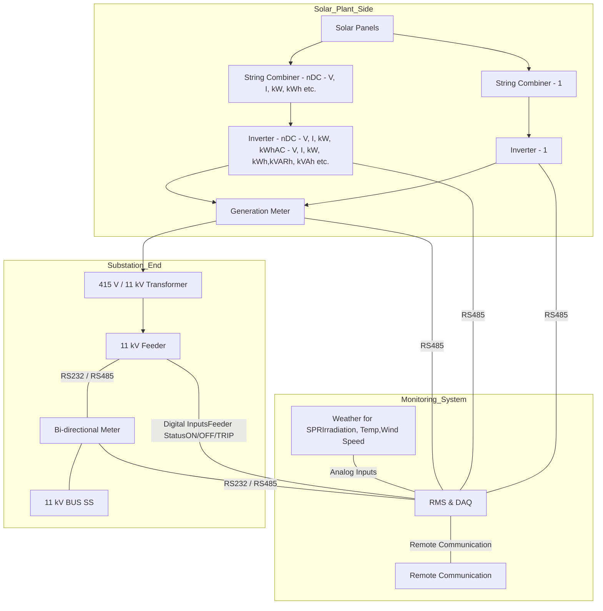

# Page 1

Ajmer Vidyut Vitran Nigam Limited logo

# AJMER VIDYUT VITRAN NIGAM LIMITED

Corporate Identification Number (CIN) - U40109RJ2000SGC016482
(Regd.Office: Vidyut Bhawan, Panchasheel Nagar, Ajmer-305004

## Office of the Superintending Engineer (SOLAR)

Vidyut Bhawan, Panchasheel Nagar, Ajmer-305004

Website : https://energy.rajasthan.gov.in/avvnl Email : sesolar.avvnl2023@gmail.com

No. AVVNL/SE (Solar)/XEN(DF) / TN-DSM-17 /D. 684 Date: 08 JUL 2025

**POOJA YADAV**

D/o Raj Kumar, Word No-15, Mohalla-Badari,

Behror, Alwar, Rajasthan-301701

Bid ID: 3046352

Kind Attention : Mr POOJA YADAV

Contact No. : 8003864044

Email Id. : dsraobhagwariya555@gmail.com

Subject: Letter of Award (LoA) against TN-DSM-17 for development of Grid connected Solar Power Plant under PM-KUSUM Scheme - Component C (Feeder Level Solarisation).

References:

1. RFS document issued vide No. AVVNL/SE(Solar)/XEN (DF)/TN-DSM-17 dtd. 13.12.2024 and subsequent amendments issued thereof.

2. Your techno commercial bid opened on dated 17-01-2025.

3. Financial bid opened on 17-02-2025.

4. CLPC meeting held on 07.03.2025.

5. Negotiation meeting held on 11-03-2025.

6. Letter of Intimation issued vide No: AVVNL/SE(Solar)/XEN(DF)/TN-DSM-17/D. 2542 dated 12.03.2025.

7. RERC order dated 07.07.2025.

On the subject and references cited above, Letter of Award (LoA) against TN-DSM-17 under PM-KUSUM Scheme - Component C (Feeder Level Solarization) is hereby placed upon you, herein after referred as Solar Power Generator (SPG), for the work of design, survey, supply, installation, testing, commissioning, operation & maintenance of grid connected solar power plant through RESCO mode, its associated 33kV line to connect the plant(s) with corresponding 33/11 kV sub-station (GSS) and RMS of solar power plant(s) for solarization of agriculture consumers connected on 33kV feeders of the following GSS, on the final negotiated and RERC approved levelized tariff as mentioned here under against TN-DSM-17.

<table>
  <thead>
    <tr>
        <th>Name of 33/11kV Sub-station</th>
        <th>Circle</th>
        <th>Division</th>
        <th>Sub-Division</th>
        <th>SPV Plant Capacity</th>
        <th>Tariff (inclusive of all taxes)</th>
        <th>Minimum Energy Generation Million Units (MU)</th>
    </tr>
  </thead>
  <tbody>
    <tr>
        <td>Kuharwas (Plant 1)</td>
        <td>Jhunjhunu</td>
        <td>XEN(O&amp;M, Khetrinagar)</td>
        <td>AEN (O&amp;M, Buhana)</td>
        <td>2.84 MWp</td>
        <td>3.02 Rs/unit</td>
        <td>4.73 MU</td>
    </tr>
  </tbody>
</table>

The terms and conditions of this LOA shall be governed by the RFS document of TN-DSM-17 dated 13.12.2024 and subsequent amendments issued there in. In case the clauses in this LOA are different from corresponding clause in the RFS document (including amendments), the Clauses of this LOA shall prevail. Further in case any clause is not included in the LOA, the same shall be governed by the RFS document (including amendments).

Scanned with OKEN Scanner

# Page 2

# 1. Scope of Work

1.1 Overall scope of work of the SPG under this RfS covers:

a. Detailed site survey;

b. Execution of land lease agreement applicable for 26 years, which includes **09 months project commissioning period or MNRE scheme sunset date (as now sunset date is 31.03.2026) which ever is earlier** (unless extended by both the parties on mutual agreement) between Land-Owner / Farmer and Solar Power Plant Developer on non-judicial stamp of applicable value for Rajasthan State and development of the land for the solar power project; (*Note: In case of any dispute between the Land-Owner / Farmer and the Bidder/ Solar Power Plant Developer, AVVNL shall 'NOT' take any responsibility on any dispute resolution or in any kind of discussions*).

c. Design, supply and installation of solar power plant near the concerned 33/11 kV substation of DISCOM, in line with requirements under MNRE guidelines;

d. Supply and erection of associated 33 kV OR, 11 kV line (as the case may be) connecting the solar power plant with concerned 33/11 kV substation (including bay, breakers and metering system at substation) as per design and specifications of DISCOM / MNRE / CEA;

e. Testing and commissioning of plant & associated 33 kV OR, 11 kV line (as the case may be) by designated official(s) of AVVNL;

f. Construction of control room or any other relative civil work (at the plant end) essential for Commissioning of Project;

g. Operation & maintenance of the solar power plant as well as 33 kV / 11 kV line (as the case may be) for 25 years (unless extended by both the parties on mutual agreement) from COD;

h. Injection of power at delivery point for 25 years at the awarded levelized tariff (Rs. per kWh) (*inclusive of applicable taxes incl. GST, duties, etc.*), extendable on mutual agreement;

i. **The delivery point for solar power plant(s) having installed capacity upto 2.55 MWp shall be 11 kV side and for installation capacity above 2.55 MWp, delivery point shall be 33 kV side of the concerned 33/11 kV GSS of DISCOM;**

j. Remote Monitoring of installed solar power plant through RMS for 25 years (unless extended by both the parties on mutual agreement);

k. It is clarified that bidder is solely responsible for land identification, hiring / procurement and further for project development. If the bidder fails to arrange the land after successful bidding, then his available bid security / bank guarantee should be forfeited, and further action shall be taken as per provision of the RTPP Act / Rules

**1.2 The condition of requirement of indigenous solar cells (DCR) under Component C (Feeder Level Solarization) shall be applicable. Therefore, it will be mandatory to use indigenously manufactured solar panels with indigenous modules and indigenous solar cells. Domestic manufacturing of solar panels will also be ensured**

# Page 3

through inspection and verification at module manufacturing unit of the respective OEM. If required, pre-dispatch inspection shall be carried out by AVVNL at the works of OEM where modules / panels are manufactured. If required, MNRE may conduct its independent inspection or verification to ensure domestic manufacturing requirement.

Additionally, all intending bidders are requested to go through the MNRE Order(s) and any amendments thereof before participating under this RfS process.

1.3 SPG shall be responsible for all the works related to testing & commissioning of the project.

1.4 In no case, Procurer or AVVNL shall be responsible to pay for increase in tariff for any work related to Project.

1.5 The project (solar power plant and associated 33 kV OR, 11 kV line, as the case may be) is to be set up with adequate arrangements upto the delivery point and O&M for 25 years (unless extended by both the parties on mutual agreement) from COD, by the SPG at its own cost and in accordance with this RfS document. All approvals, permits and clearances required for setting up of the Project including those required from State Government and local bodies along with any associated cost for getting the clearances shall be in the scope of the SPG.

1.6 It shall be the responsibility of the SPG, entirely at its cost and expense, to install such number of solar panels and associated equipment as may be necessary to achieve the required minimum CUF of 19%, and for this purpose selected bidder shall make its own study and investigation of the Global Horizontal Irradiation (GHI) and other factors prevalent in the area which have implication on the quantum of generation.

1.7 All components used for installation of solar power plants shall confirm to applicable BIS / MNRE specifications and follow quality control guidelines issued by MNRE.

1.8 The scope of work shall also include submission of following by the SPG:

a. A layout plan of the site to the Inspecting Authority clearly indicating the identified location for installation of solar power plant & control room, where control panels shall be installed;

b. Detailed planning of time bound smooth execution of Project;

c. Performance testing of the completion and successful commissioning of the Project;

d. O&M plan for the plant and 33 kV OR 11 kV line (as the case may be) for twenty-five (25) years from COD to assure faultless operation;

e. Inventory plan to ensure availability of spare parts for minimal / no downtime of the project and/or, 33 kV / 11 kV line, as the case may be, during the term of PPA;

f. Coverage of risk liability of all personnel associated with implementation and realization of the Project.

1.9 Developer can either approach the registered farmer / land owner on SKAY or arrange the required land on their own land.

# Page 4

**1.10** One land parcel can be offered by multiple bidders but if awarded, final lease agreement shall be only for one SPV plant.

**1.11** SPV plant wise L1 bidder shall be identified for award of contract (post negotiation as per RTPP rules).

**1.12** After award of contract, in case of any dispute / litigation on the originally proposed land, the developer shall be bound to arrange alternative land for the solar project.

**1.13** Multiple plants for single capacity can be installed but with common injection line at single point of injection.

# 2. Metering and grid connectivity

2.1. Metering and grid connectivity of the projects would be the responsibility of the SPG in accordance with the prevailing guidelines / practices of DISCOM and / or CEA. AVVNL may facilitate in the process; however, the entire responsibility lies only with the SPG.

2.2. Meters and metering equipment (CT-PT sets) shall be tested as per provision of RERC and as per IS 14697 at CPRI or at any NABL accredited / distribution licensee lab before installation at site at the cost of SPG and should be properly sealed in the presence of designated authority from AVVNL at the time of installation.

2.3. The accuracy class, current rating and certifications of the metering system shall confirm with relevant CERC / RERC Regulations, Grid Code and Central Electricity Authority (Installation and Operation of Meters) Regulations, 2006 as amended and revised from time to time.

2.4. SPG to install 3 ABT meters (main, check and standby) with RMS connectivity AND 2 CT-PT sets (one for main & check meter and another for standby meter) at substation end of the 33 kV OR 11 kV line (as the case may be). An indicative layout of metering arrangement is given below:

Indicative layout of metering arrangement for Solar PV Plant and 33/11kV substation

2.5. Installation and timely replacement of meters (main, check and standby) as required to directly measure energy supplied by the Solar Power Plant shall be the responsibility of selected bidder.

2.6. The cost of all required meters (main, check, standby meter at substation end) and associated CT-PT sets shall be borne by the SPG

# Page 5

# 3. Remote Monitoring System (RMS)

3.1. As per the MNRE guidelines for feeder level solarization under Component C of KUSUM scheme, it is mandatory for Discoms to monitor solar power generation and performance of the solar power plant through online system. The online data will be integrated with central monitoring portal of MNRE which will extract data from the State portals for monitoring of the scheme.

3.2. In line with MNRE model guidelines for State Level SEDM Software Development issued in July 2020, State Level Solar Energy Data Management (SEDM) platform has been developed to integrate & monitor the performance of all systems installed under Component A, B & C (individual as well as feeder level solarization) of PM-KUSUM scheme.

3.3. Also, as per the Specifications for Remote Monitoring System for Component A & C of the scheme, issued by MNRE on 15 Jul 2020, the SPG under this RfS shall be required to install required remote monitoring systems for solar power plant to integrate with State SEDM platform directly which in turn will have interface with National Level Solar Energy Data Management Platform of MNRE.

3.4. MNRE and Discoms will develop and host the of National and State Level SEDM platform, which is excluded from the scope of the SPG, but SPG needs to operate and do various data entries related to application processing, asset and workflow mgmt.

### Sub Station End

### Solar Plant Performance & Feeder Availability Monitoring

3.5. As shown in above diagram SPG needs to provide a remote monitoring system for:

(a) **Solar Power Plant Remote Monitoring system**: To capture electrical parameters from multiple devices such as ABT Meter, Generation Meter, Inverters, String Combiner boxes or String

# Page 6

inverters. Remote monitoring system will capture important Electrical and Status parameters such as AC/DC voltage, control, power, energy as well as monitoring of Breaker etc and will transmit data to State Level Solar Energy data management (SEDM) platform. It shall be also possible to control Inverter Active and Reactive power.

(b) **Communication Connectivity** for Solar Plant RMS:

i. <u>Field Device Connectivity</u>: RMS will connect to Inverter, String combiner boxes or string inverters using RS485 MODBUS communication protocol as well as meters using RS232 DLMS protocol. Both protocols are widely used by equipment manufacturers.

ii. <u>Remote Connectivity</u>: RMS will connect to State Level SEDM Server using 2G/3G/4G or any other suitable cellular communication.

<u>Local Connectivity</u>: Ethernet / Bluetooth / Wi-Fi connectivity to configure parameter, notifications, communication intervals, set points, operation mode configuration or to download locally stored data.

3.6. Details of Communication Modes, Communication Protocols, Security and Message formats and equipment wise parameter details shall be provided to successful bidder.

3.7. It is the responsibility of SPG to provide SIM card, recurring communication charges and maintain communication connectivity of more than 96% and data availability of 99% for the 25 years (unless extended by both the parties on mutual agreement) of operation & maintenance of solar power plant and its associated 33 kV line 'OR' 11 kV line.

# 4. Insurance

4.1. The SPG shall also take insurance for third party liability covering loss of human life, engineers and workmen and also covering the risks of damage, theft of material/ equipment/ properties after completion of the work(s). Before commencement of the work, the SPG shall ensure that all its employees and representatives are covered by suitable insurance against any damage, loss, injury or death arising out of the execution of the work. Liquidation, Death, Bankruptcy etc., shall be the responsibility of SPG only.

# 5. Aapplication of Insurance Proceeds

a. In case of the Project not being implemented through Financing Agreement(s), save as expressly provided in this Agreement or the Insurances, the proceeds of any insurance claim made due to loss or damage to the Power Project or any part of the Power Project shall be first applied to reinstatement, replacement or renewal of such loss or damage.

b. In case of the Project being financed through Financing Agreement(s), save as expressly provided in this Agreement or the Insurances, the proceeds of any insurance claim made due to loss or damage to the Power Project or any part of the Power Project shall be applied as per such Financing Agreements.

c. If a Force Majeure Event renders the Power Project no longer economically and technically viable and the insurers under the Insurances make payment on a "total

# Page 7

loss" or equivalent basis, AVVNL shall have claim on such proceeds of such Insurance limited to outstanding dues of AVVNL against SPG.

## 6. Type and quality of materials and workmanship

6.1. The design, supply, installation, testing, commissioning, operation and maintenance of the solar power plant and the associated 33 kV OR, 11 kV line (as the case may be) shall be in accordance with latest / appropriate IEC/Indian Standards. Where appropriate Indian Standards and Codes are not available, other suitable standards and codes as approved by the MNRE / CEA / RERC / AVVNL shall be used. All the relevant test certifications **must be kept valid up to one (1) Year from the COD** of the Project.

6.2. The SPG shall ensure that the specifications of the components / equipments like 33 kV OR 11 kV circuit breaker, 33 kV OR 11 kV CT-PT metering unit, etc should meet the technical specifications of AVVNL.

6.3. Any material / equipment which have not been specifically mentioned in this RfS but which are necessary during construction or O&M period of the plant & associated 33 kV OR, 11 kV line (as the case may be) shall be provided by the SPG without any extra cost and within the time schedule for efficient and smooth construction and O&M activities.

## 7. Completion and commissioning

7.1. Part Commissioning is **'NOT'** allowed for the Project. SPG, in coordination with AVVNL, shall submit commissioning certificate, issued by AVVNL, in accordance with all applicable regulations / policies. For the purpose of obtaining Completion certificate following documents shall be required:

a) Inspection Report of the Work(s) for all equipments / material

b) CEIG approval for the PPA Capacity and 33 kV OR 11 kV line (as the case may be).

## 8. Completion Period

8.1. The design, survey, supply, installation, testing and commissioning of solar power plant with associated 33 kV OR, 11 kV line (as the case may be) connecting the solar power plant with concerned substation and RMS of solar power plant as per terms & conditions of this RfS is to be completed within **09 months from date of issuance of LoA or MNRE scheme sunset date (as now sunset date is 31.03.2026) which ever is earlier.**

## 9. Delay in commissioning

9.1. A duly constituted Committee of AVVNL officials will physically inspect the Solar Power Plant in not more than 03 days from the date of receiving a call from the SPG and certify successful commissioning of the solar power plant.

9.2. In case any SPG fails to achieve this milestone, AVVNL shall encash the Performance Bank Guarantee (PBG) as liquidated damages (LD) in the following manner:

<u>Delay up to two months:</u> LD equal to the PBG on per day basis. The no. of days in "month" for the LD calculation shall be considered as 30.

<u>In case the commissioning of the solar power plant is delayed over two months:</u> The complete PBG amount shall be encashed and PPA shall stand cancelled.

signature

# Page 8

In case of delays of plant commissioning due to the reasons beyond the control of the SPG, Procurer / AVVNL after having been satisfied with documentary evidences produced by the SPG for the purpose, can extend the time for commissioning date without any financial implications on the SPG.

## 10. Project milestones and timeline

<table>
  <thead>
    <tr>
        <th>S. No.</th>
        <th>Milestone</th>
        <th>Timeline</th>
    </tr>
  </thead>
  <tbody>
    <tr>
        <td>1</td>
        <td>Issuance of Letter of Intent (LoI) / Intimation Letter to the successful bidder</td>
        <td>T1</td>
    </tr>
    <tr>
        <td>2</td>
        <td>Unconditional acceptance of LoI / Intimation Letter by successful Bidder</td>
        <td>T1 + 03 days</td>
    </tr>
    <tr>
        <td colspan="3"><strong>Petition filing by AVVNL to RERC for adoption of discovered levelized tariff for the solar power plant</strong></td>
    </tr>
    <tr>
        <td>3</td>
        <td>Issuance of work order after approval of discovered tariff by RERC (tentatively 01 month) to the successful bidder</td>
        <td>T2</td>
    </tr>
    <tr>
        <td>4</td>
        <td>Unconditional acceptance of work order by successful Bidder</td>
        <td>T2 + 03 days</td>
    </tr>
    <tr>
        <td>5</td>
        <td>Submission of Performance Bank Guarantee (PBG), Team mobilization and Site survey</td>
        <td>T2 + 01 month</td>
    </tr>
    <tr>
        <td>6</td>
        <td>Signing of PPA between selected bidder (SPG) and RUVITL (on behalf of AVVNL)</td>
        <td>T2 + 02 Months</td>
    </tr>
    <tr>
        <td>7</td>
        <td>Completion of design, supply, installation, testing and commissioning of the SPV power plant and associated 33 kV OR 11 kV line for connecting solar power plant with concerned substation</td>
        <td>T2 + 09 months or MNRE scheme sunset date (as now sunset date is 31.03.2026) which ever is earlier</td>
    </tr>
    <tr>
        <td>8</td>
        <td>Operation and maintenance of power plant and associated 33 kV OR 11 kV line</td>
        <td>25 years from COD (unless extended by both the parties on mutual agreement)</td>
    </tr>
  </tbody>
</table>

## 11. Clearances required from the state government and other local bodies

a) The SPG is required to obtain necessary clearances and permits as required for setting up the Solar Power Project, including but not limited to the following:

* i. Approval for water from the concerned authority (if applicable) required for the solar power plant and/or, associated 33 kV OR, 11 kV line (as the case may be).

* ii. Any other clearances (forest dept., etc) as may be legally required, in order to establish and operate the solar power plant and/or, associated 33 kV OR, 11 kV line (as the case may be).

b) The above clearances, as applicable for the solar power plant and/or, associated AVVNL prior to commissioning of the Project. In case of any of the clearances as indicated above being not applicable for the said Project, the SPG shall submit an undertaking in this regard, and it shall be deemed that the SPG has obtained all the necessary clearances for establishing and operating the Project. Any consequences

# Page 9

contrary to the above shall be the responsibility of the SPG. The SPG shall coordinate with AVVNL in case of any clarifications.

c) Any cost associated with getting the above required clearances for the project shall be borne by the SPG only.

# 12. Applicable Land Lease Rent

a) In case the land is leased to the Solar Power Plant Developer and plant is developed by Solar Power Plant Developer, then the applicable annual lease rent (Rs. per hectare) applicable to this RfS (as per SKAY Scheme) shall be applicable as per following for initially 26 years (including 25 years PPA duration):

<table>
  <thead>
    <tr>
        <th>Prevailing DLC rate of Land at the time of registration (Rs. per hectare)</th>
        <th>Indicative Annual Lease Rent (Rs. per hectare)</th>
    </tr>
  </thead>
  <tbody>
    <tr>
        <td>Upto 8 lakhs</td>
        <td>80,000</td>
    </tr>
    <tr>
        <td>More than 8 lakhs and less than 12 lakhs</td>
        <td>1,00,000</td>
    </tr>
    <tr>
        <td>More than 12 lakhs and less than 20 lakhs</td>
        <td>1,40,000</td>
    </tr>
    <tr>
        <td>More than 20 lakhs</td>
        <td>1,60,000</td>
    </tr>
  </tbody>
</table>

b) The above applicable annual lease rent (Rs. per hectare) shall be **escalated 5% every two years.**

c) Solar Power Plant developer to pay the agreed lease rent amount to the land-owner / farmer, authorized individual directly as per agreement payable during plant installation and commissioning phase (*i.e. 09 months from date of issuance of LoA* **or MNRE scheme sunset date (as now sunset date is 31.03.2026) which ever is earlier**).

d) AVVNL / RUVITL to pay the applicable land lease rent (after signing of **bi-partite agreement** between land owner / farmer & developer and after signing of tripartite agreement (format enclosed as **Annexure - II**) between land owner / farmer, developer & RUVITL) directly to the land-owner / farmer or, authorized individual after recovering the same from the monthly energy payables to developer after commissioning of the solar power plant.

e) The applicable lease rent under the scheme shall be payable to the land-owner / farmer or, authorized individual only after meeting following conditions as below:

i. Work for setting up a solar PV project on the referenced land is awarded to a developer by AVVNL;

ii. The selected developer has executed **bi-partite land lease agreement** with the land-owner / farmer for the land registered.

**Note:** For more details about the SKAY Scheme including its modalities, please visit https://skayrajasthan.org.in

# 13. Notice Board for display at site

a) The selected bidder will have to put a notice board (atleast 180 cm x 120 cm) at its project site main entrance prominently displaying the following message before declaration of COD:

Scanned with OKEN Scanner

# Page 10

# ........ MWp Grid Connected Solar PV Project

Owned and operated by ...\<insert name of the selected bidder\>...

Implemented by \<DISCOM name\> under Component C (Feeder Level Solarization) of

PM-KUSUM Scheme

... \<Name of location, district\>..., Rajasthan

# 14. Central Financial Assistance

SPG to get eligible CFA as per scheme guidelines issued by MNRE (in-line with MNRE Order Dated 01.03.2024) as mentioned below :

— First release of 30% of the eligible CFA shall be released on completion of 30% of the total work;

— Second release of 30% of the eligible CFA shall be released on completion of 75% of the total work; and

— Final release of 40% of the eligible CFA shall be released on the successful completion of the total work. This 40% shall be released through AVVNL on successful operation and performance of the solar plant for six (06) months after the commissioning, with achievement of at least one (01) month CUF as per the minimum CUF agreed in PPA.

# 15. Performance Bank Guarantee.

15.1. The successful bidder "OR" in the name of Special Purpose Vehicle (SPV) shall be required to furnish Performance Bank Guarantee of (Rs. 5 Lakhs per MW for bid quantity / capacity in MWp) within 01 month from date of issue of Work order. The Performance bank guarantee shall be returned after 02 months of commissioning of the project.

15.2. The Performance Bank Guarantee shall be in the Form of unconditional Bank Guarantee as per the Format K.18 of RFS in favour of "Superintending Engineer (SOLAR), AVVNL, Ajmer" and to be submitted at the office of Sr. AO (PROJECT), AVVNL, Ajmer.

15.3. It shall be responsibility of selected bidder "OR" Special Purpose Vehicle (SPV) to get the PBG extended, if required, such that it is valid till 02 months after date of commissioning of project.

15.4. Non submission of PBG within the above mentioned timelines shall be treated as follows:

(a) Delay upto 01 month from due date of submission of PBG: Delay charges @1% of the PBG amount per month levied on per day basis shall be paid by the selected bidder to AVVNL in addition to the PBG amount.

In case of delay in making full payment of above delay charges, the amount paid, if any, until the above deadline, along with interest, shall be first reduced from the total amount due towards the delay charges and interest amount (i.e. rate of interest as stated above). Further, balance amount to be paid shall attract Interest rate @12% per year.

# Page 11

(b) Delay beyond 01 month from the due date of submission of PBG: The Project shall stand terminated.

15.5. For the purpose of calculation of the above delay charges, "month" shall be considered as a period of 30 days. The selected bidder shall furnish the PBG from any Government bank and in case of private bank as enlisted in in SECTION - C: of the RfS.

15.6. In case of award of the contract to a Joint Venture, the Bank Guarantees for performance bank guarantee shall be submitted in the name of all the partner(s) of the Joint Venture "OR" in the name of Lead/other Partner in the Joint Venture submitting the bid "**OR**" **in the name of Special Purpose Vehicle (SPV).**

15.7. The BG for performance bank guarantee shall be executed on Rajasthan Non-Judicial Stamp Paper worth 0.25% of BG value or Rs. 25,000/- whichever is lower.

## 16. Forfeiture of Performance bank guarantee:

16.1. Apart from cases mentioned in the RfS regarding forfeiture of Performance bank guarantee, the Performance bank guarantee amount in full or part may also be forfeited in the following cases:

a) Failure in executing the PPA;

b) When the terms and conditions of contract is breached / infringed by the SPG;

c) When contract is being terminated due to non-performance by the SPG.

Notice of reasonable time will be given in case of forfeiture of Performance bank guarantee deposit. The decision of the AVVNL, as applicable, in this regard shall be final.

16.2. No interest will be paid by AVVNL on the amount of Performance bank guarantee.

## 17. Signing of PPA:

17.1. Power Purchase Agreement (PPA) shall be signed, (after unconditional acceptance of Work Order by Contractor and submission of PBG) **within 02 months from date of issuance of Letter of Award (LoA). The successful developer will also submit PBG for acceptance of AVVNL as per timeline prescribed in RfS and in line with draft format enclosed as Format K.20.** The PPA shall be valid for a period of 25 years from COD as per provisions of PPA. Any extension of the PPA period beyond 25 years shall be through mutual agreement between the SPG and RUVITL / AVVNL.

17.2. If the bidder, whose bid has been accepted, fails to furnish the required PBG or fails to sign a PPA within specified period, AVVNL shall take action against such bidder as per the provisions of the RTPP Act and rules. AVVNL may, in such case, may cancel the tender process or if it deems fit, offer the L1 tariff to the next lowest or most advantageous bidder for acceptance, in accordance with the criteria and procedures set out in this RfS.

# Page 12

17.3. The bidder shall be asked to execute the PPA on a non-judicial stamp of Rajasthan State of **Rs. 500 or the prevailing stamp duty whichever is higher** and shall be submitted to the office of SE (PP), RUVITL, Jaipur with copy to Office of The Superintending Engineer (SOLAR), AVVNL, Ajmer.

17.4. All expenditure towards execution of Bank Guarantees such as stamp duty etc. shall be borne by the SPG.

**17.5. <u>Penalty due to delay in signing of PPA:</u> In case the selected bidder / successful solar power developer fails to execute the Power Purchase Agreement (PPA) within the stipulated time period (i.e, within 02 months from the date of issuance of LoA), the amount equivalent to Bid Security / EMD shall be recovered from Bid Security / Performance Bank Guarantee available with AVVNL as penalty.**

# 18. Energy measurement for Monthly billing

a) **Until Remote Monitoring System (RMS) of the solar power plant under the LoA is made operational by the SPG (as per the stipulated timeline) OR, any issue / failure of RMS,** the energy measurement for monthly billing shall be based on the CMRI data of meter(s) i.e. The meter readers on the first (1st) day of each Month at 00:00 hrs., of the Main, check and standby Meters shall be taken into consideration for energy measurements for monthly billing. The CMRI data shall be downloaded for all three meters jointly by concerned XEN (meter) of AVVNL and authorized representative of SPG.

b) Subsequently, the SPG shall furnish the joint meter reading report (JMR) / Energy Account; duly verified by its authorized representative, and concerned XEN (Meter), along with downloaded CMRI data (of all three meters) to RUVITL through courier and/or e-mail along with the Monthly Bill (final energy net of import and export, multiplied by the Rs. per kWh tariff as per PPA and reactive power charges or any other charges compensation) on the same day (i.e., 1st day of the month).

c) **After successful start of operation of RMS of the solar power plant as per work order,** the energy measurement for monthly billing shall be done through the data remotely available from the solar power plant.

d) Provided that:

i. if the date of commencement or supply of power falls during the period between the first (1st) day and up to and including the fifteenth (15th) day of a Month, the first Monthly Bill shall be issued for the period until the last day of such Month, or

ii. if the date of commencement of supply of power falls after the fifteenth (15th) day of a Month, the first Monthly Bill shall be issued for the period commencing from the Delivery Date until the last day of the immediately following Month.

e) Provided further that if a Monthly Bill is received on or before the second (2nd) day of a Month, it shall be deemed to have been received on the second (2nd) Business Day of such Month.

# Page 13

f) Provided further that if a Monthly Bill for the immediately preceding Month is issued after 1st day of the next Month, the Due Date for payment of such Monthly Bill shall be extended accordingly.

## 19. Inspection and Testing of Meters

a) AVVNL and SPG shall jointly inspect and if necessary, recalibrate the metering system on a regular basis but in any event, at least once every year or at a shorter interval at the request of any of the two parties.

b) Each Meter comprising the metering system shall be sealed by AVVNL, and shall be opened, tested, or calibrated in the presence of both the parties.

## 20. Inaccuracy of Meters

a) In case the difference between the energy recorded in the main meter and the check meter for any calendar month is within 0.5%, the energy recorded in the main meter shall be taken as final.

b) However, if the variation exceeds ±0.5%, following steps shall be taken:

i. Both interface meters (Main as well Check) and metering system shall be tested and checked.

ii. Re-Calibration of both meters at site with reference standard meter of accuracy class higher than the meter under test, if no issues found in step (a) above.

iii. On carrying out the re-calibration of the main meter, if it is discovered that either the percentage of inaccuracy exceeds ±0.5% or that the main meter is not working, the following procedure in order of priority, whichever is feasible, for arriving at the computation of quantity of energy during the period between the last calibration and the present, shall be followed:

- On the basis energy recorded in the check meter if installed and functioned accurately; or

- By correcting the error, if the percentage of error is ascertainable from calibration, tests, or mathematical calculation.

iv. The correction to the quantity of energy injected shall apply to the following periods (hereinafter referred to as the "Correction Period"):

- To any period of time during which the main meter was known to be malfunctioning or to which the parties mutually agree;

- If the period during which the main meter was malfunctioning is not known or is not agreed to between the parties, the correction shall be applicable for a period equal to half the time elapsed since the date of the preceding calibration test, provided that under no circumstance shall the Correction Period exceed one month.

v. If the difference exists even after such checking or testing, then the defective meter(s) shall be replaced with a tested meter.

# Page 14

vi. In case of conspicuous failures like burning of meter and erratic display of metered parameters and when the error found in testing of meter is beyond the permissible limit of error provided in the relevant standard, the meter shall be immediately replaced with a tested meter.

vii. In case where both the Main meter and Check meter fail, energy recorded in the Standby meter shall be considered as final and at least one of the meters shall be immediately replaced by a tested meter.

# 21. Billing and Payment

## 21.1. General

a) From the Commercial Operations Date of the solar power plant, RUVITL (on behalf of AVVNL) shall pay to the selected SPG the monthly Tariff Payments subject to the adjustments as per provisions of the PPA and submission of following indicative documents **(in two copies)** along with first energy invoice:

(1) Original signed invoice as per PPA and applicable RERC Regulation addressing to SE (Billing), RUVITL (On behalf of AVVNL), 132 KV GIS Building, Calgiri Road, Malviya Nagar, Jaipur.

(2) Photocopy of Power Purchase Agreement.

(3) Original Joint Meter Reading (Export Energy, Import Energy, Net Energy, kVArh, kVAh, Maximum Demand, Power Factor).

(4) Undertaking regarding detail of Free Energy, if any injected in the system between date of connectivity and COD as per format-1 (shall be included before signing of PPA).

(5) Memorandum of Association (MoA), if applicable.

(6) Board Resolution Letter / Proprietor Deed / Partnership Deed, if applicable.

(7) Authority Letter authorizing the signing authority (original).

(8) Photocopy of Pan Card of SPG Owner and Signing Authority.

(9) Signing Authority ID Proof (Aadhar Card).

(10) MoM of Connectivity.

(11) MoM of Commissioning.

(12) Commissioning Certificate issued by competent authority.

(13) Synchronization Certificate.

(14) A copy of insurance of the power plant and interconnection facility system as per PPA.

# Page 15

(15) Validity of Performance Bank Guarantee (PGB).

(16) Photocopy of Tri-partite Land Lease Agreement including cancelled cheque and Passbook Copy.

(17) Any other documents as required by RUVITL (on behalf of AVVNL).

**b) For the subsequent monthly energy invoice, the SPG will have to furnish the documents appearing at Sr. No. (1) and (3) as mentioned under clause 4.1.1 (a) of this RfS in two (02) copies.**

c) All Tariff Payments by RUVITL shall be in Indian Rupees.

d) The SPG shall be required to make arrangements and payments for import of energy (if any) as per applicable regulations.

e) The SPG shall be required to pay the land rent to AVVNL / RUVITL in line with "Applicable Land Lease Rent" as per clauses under this RfS.

f) Reactive power charges or any other charges as per CERC / RERC regulations shall be payable by SPG as per provisions of PPA.

## 21.2. <u>Delivery and Content of Monthly Bills / Supplementary Bills</u>

a) The SPG shall issue to RUVITL hard copy of a signed Monthly Bill for the immediately preceding Month based on the JMR / Energy Account along with all relevant documents (payments made by selected bidder for drawl of power, payment of reactive energy charges, Metering charges or any other charges as per regulations of CERC / RERC, if applicable.)

b) Each Monthly Bill shall include all charges as per the Agreement for the energy supplied for the relevant Month based on JMR / Energy Accounts. The Monthly Bill amount shall be the product of the energy as per Energy Accounts and the applicable levelized tariff. Energy drawn from the grid will be regulated as per the regulations of respective State the Project is located in.

## 21.3. <u>Payment of Monthly Bills</u>

a) On receipt of JMR/Energy Account along with CMRI data (of both meters) and bill, RUVITL shall verify the readings and subsequent share the same along with original bill and other relevant documents to Rajasthan Urja Vikas and IT Services Limited (RUVITL).

b) RUVITL shall prepare the final accounts for the amount payable under the Monthly Bill by the Due Date to such account of the selected bidder, as shall have been previously notified by the SPG.

c) As defined under the PPA, 'Due Date' shall mean the forty-fifth (45th) day after a Monthly Bill (including all the relevant documents) or a Supplementary Bill is received in hard copy and duly acknowledged by SE (Billing), RUVITL (on behalf of AVVNL), 132 kV GIS Building, Calgiri Road, Malviya Nagar, Jaipur or, if such day is not a Business Day, the immediately succeeding Business Day, by which date such Monthly Bill or a Supplementary Bill is payable by RUVITL.

# Page 16

d) All payments required to be made under this Agreement shall also include any deduction or set off for:

i. deductions required by the Law; and

ii. Amount claimed by AVVNL / RUVITL, if any, from the SPG, will be adjusted from the monthly energy payment.

iii. Charges for import of energy by the solar plant from the grid @ applicable tariff as per order of RERC.

e) The SPG shall open a bank account (if not having any bank account) for all Tariff Payments to be made by RUVITL to the SPG and notify AVVNL / RUVITL of the details of such account at least sixty (60) Days before the dispatch of the first Monthly Bill.

<u>21.4. Late Payment Surcharge</u>

In case the payment of bills of renewable energy tariff is delayed beyond a period of 45 days from the date of presentation of bills, a late payment surcharge equivalent to Base Rate as on 1st April of the respective year plus 400 basis points per annum on daily basis shall be levied by the Generating Company.

<u>21.5. Rebate</u>

a) For payment of any Bill on or before Due Date, the following Rebate shall be paid by the SPG to AVVNL / RUVITL in the following manner and the SPG shall not raise any objections to the payments made under this article.

i. For payment of bills of the SPG within 5 working days of presentation of bills, a rebate of 1.5% shall be allowed.

<i>Explanation: In case of computation of ‘5 days’ the number of days shall be counted consecutively without considering any holiday. However, in case the last day or 5th day’s official holiday, the 5th day for the purpose of Rebate shall be construed as the immediate succeeding working day (as per the official State Government’s calendar, where the Office of the Authorized Signatory or Representative of the beneficiary, for the purpose of receipt or acknowledgement of bill is situated).</i>

ii. If payments of bills of SPG are made beyond 5 working days but within a period of 30 days of presentation of bills, a rebate of 1% shall be allowed.

iii. No rebate shall be payable to AVVNL / RUVITL for payments made after 30 clear working days of the date of presentation of hard copy of the bill along with the required supporting documents at AVVNL office upto due date.

iv. For the above purpose, the date of presentation of Bill shall be the next Business Day of delivery of the physical copy of the Bill at RUVITL.

Page 16

# Page 17

v. No Rebate shall be payable on the Bills raised on account of Change in Law relating to taxes, duties, cess etc. and on Supplementary Bill.

b) For the above purpose date of presentation of bill shall be the same day of delivery in hard copy. However, for consideration of rebate, next business day shall be considered.

## 21.6. Quarterly and Annual Reconciliation

a) The Parties acknowledge that all payments made against Monthly Bills and Supplementary Bills shall be subject to quarterly reconciliation within 30 days of the end of the quarter at the beginning of the following quarter of each Contract Year and annual reconciliation at the end of each Contract Year within 30 days to take into account the Energy Accounts, Tariff adjustment payments, Tariff Rebate, Late Payment Surcharge, or any other reasonable circumstance provided under this Agreement.

b) The Parties, therefore, agree that as soon as all such data in respect of any quarter of a Contract Year or a full Contract Year as the case may be has been finally verified and adjusted, the SPG and AVVNL / RUVITL shall jointly sign such reconciliation statement. Within fifteen (15) days of signing of a reconciliation statement, the SPG shall make appropriate adjustments in the next Monthly Bill. Late Payment Surcharge / interest shall be payable in such a case from the date on which such payment had been made to the invoicing Party or the date on which any payment was originally due, as may be applicable. Any Dispute with regard to the above reconciliation shall be dealt with in accordance with the provisions of Article 16 of PPA.

## 21.7. Payment of Supplementary Bill

a) SPG may raise a ("Supplementary Bill") for payment on account of:

i. Adjustments required by the Energy Accounts (if applicable); or

ii. Change in Law as provided in Article 12 of PPA.

And such Supplementary Bill shall be paid by the other Party.

b) RUVITL shall remit all amounts due under a Supplementary Bill raised by the SPG to the Designated Account by the Due Date, except open access charges, RLDC or scheduling charges and transmission charges (if applicable). For Supplementary Bill on account of adjustment required by energy account, Rebate as applicable to Monthly Bills shall equally apply. No surcharge will be applicable other than that on the monthly energy payment and associated debit and credit note.

c) In the event of delay in payment of a Supplementary Bill by either Party beyond its Due Date, a Late Payment Surcharge shall be payable at the same terms applicable to the Monthly Bill.

# Page 18

# 22. Payment Security Mechanism

## 22.1. Letter of Credit (LC):

a) RUVITL shall provide to the SPG, in respect of payment of its Monthly Bills and/or Supplementary Bills, a monthly unconditional, revolving and irrevocable letter of credit (“Letter of Credit”), opened and maintained which may be drawn upon by the SPG in accordance with the PPA.

b) Not later than one (01) Month before the start of supply, RUVITL through a scheduled bank open a Letter of Credit in favour of the SPG, to be made operative from a date prior to the Due Date of its first Monthly Bill under this Agreement. The Letter of Credit shall have a term of twelve (12) Months and shall be renewed annually, for an amount equal to:

i. for the first Contract Year, equal to the estimated average monthly billing;

ii. for each subsequent Contract Year, equal to the average of the monthly billing of the previous Contract Year.

c) Provided that the SPG shall not draw upon such Letter of Credit prior to the Due Date of the relevant Monthly Bill and/or Supplementary Bill, and shall not make more than one drawal in a Month.

d) Provided further that if at any time, such Letter of Credit amount falls short of the amount specified above due to any reason whatsoever, RUVITL shall restore such shortfall within fifteen (15) days.

e) RUVITL shall cause the scheduled bank issuing the Letter of Credit to intimate the SPG, in writing regarding establishing of such irrevocable Letter of Credit.

f) RUVITL shall ensure that the Letter of Credit shall be renewed not later than its expiry.

g) All costs relating to opening, maintenance of the Letter of Credit shall be borne by RUVITL.

h) If RUVITL fails to pay undisputed Monthly Bill or Supplementary Bill or a part thereof within and including the Due Date, then, subject to above, the SPG may draw upon the Letter of Credit, and accordingly the bank shall pay without any reference or instructions from AVVNL / RUVITL, an amount equal to such Monthly Bill or Supplementary Bill or part thereof, in accordance with above, by presenting to the scheduled bank issuing the Letter of Credit, the following documents:

i. a copy of the Monthly Bill or Supplementary Bill which has remained unpaid to SPG and;

Page 18

Scanned with OKEN Scanner

# Page 19

ii. a certificate from the SPG to the effect that the bill at item (a) above, or specified part thereof, is in accordance with the Agreement and has remained unpaid beyond the Due Date;

**22.2. Escrow Arrangement:**
AVVNL shall also establish escrow arrangement in favour of SPG(s), AVVNL shall enter into a Tri-partite Escrow Agreement to be executed amongst SPG as Borrowers, Financing Institutions as Lender and RUVITL (on behalf of AVVNL) as Power Procurer wherein AVVNL obligation is restricted only to the extent that all the tariff payments shall be made remitted / credited to the notified bank account of the SPG(s) designated as Escrow Account as per the provisions of PPA. The Tri-partite Escrow Agreement will be integral part of the PPA (**Indicative format is enclosed as Annexure – III**).

# 23. Disputed Bill

a) If AVVNL / RUVITL does not dispute a Monthly Bill or a Supplementary Bill raised by the SPG within fifteen (15) days of receiving such Bill shall be taken as conclusive.

b) If AVVNL / RUVITL disputes the amount payable under a Monthly Bill or a Supplementary Bill, as the case may be, it shall pay undisputed amount of the invoice amount and it shall within fifteen (15) days of receiving such Bill, issue a notice (the "Bill Dispute Notice") to the invoicing Party setting out:

i. the details of the disputed amount;

ii. its estimate of what the correct amount should be; and

iii. all written material in support of its claim.

c) If the SPG agrees to the claim raised in the Bill Dispute Notice, the SPG shall revise such Bill and present along with the next Monthly Bill. In such a case excess amount shall be refunded along with interest at the same rate as Late Payment Surcharge, which shall be applied from the date on which such excess payment was made by the disputing Party to the invoicing Party and up to and including the date on which such payment has been received as refund.

a) If the SPG does not agree to the claim raised in the Bill Dispute Notice, it shall, within fifteen (15) days of receiving the Bill Dispute Notice, furnish a notice (Bill Disagreement Notice) to RUVITL (i.e., SE (Billing), RUVITL (on behalf of AVVNL), 132 kV GIS Building, Calgiri Road, Malviya Nagar, Jaipur) providing:

i. reasons for its disagreement;

ii. its estimate of what the correct amount should be; and

iii. all written material in support of its counter claim.

b) Upon receipt of the Bill Disagreement Notice SE (Billing), RUVITL (on behalf of AVVNL), 132 kV GIS Building, Calgiri Road, Malviya Nagar, Jaipur, authorized

# Page 20

representative(s) or a director of the board of directors / member of board of the AVVNL / RUVITL and SPG shall meet and make best endeavours to amicably resolve such dispute within fifteen (15) days of receipt of the Bill Disagreement Notice.

d) If the Parties do not amicably resolve the Dispute within fifteen (15) days of receipt of Bill Disagreement Notice, the matter shall be referred to Dispute resolution in accordance with Article 16 of PPA.

e) For the avoidance of doubt, it is clarified the despite a Dispute regarding an invoice, AVVNL / RUVITL shall, without prejudice to its right to Dispute, be under an obligation to make payment of undisputed amount of the invoice amount in the Monthly Bill.

# 24. Minimum Generation Guarantee

24.1. The Selected bidder shall provide a minimum generation guarantee corresponding to a capacity utilization factor (CUF) of 19% (the "**Guaranteed CUF**") with respect to the AC capacity of the PV system.

24.2. This Guaranteed CUF shall be calculated on an annual-basis and shall be verified by AVVNL at the end of each year during the 25 (twenty-five) years operation period or any extension thereof on mutual agreement.

24.3. There shall be no year-on-year reduction on the Guaranteed CUF during the 25 (twenty-five) years period.

24.4. In case at any point of time, the peak of capacity reached is higher than the contracted capacity and causes disturbance in the system at the point where power is injected, the SPG will have to forego the excess generation and reduce the output to the contract capacity and shall also have to pay the penalty/charges (if applicable) as per applicable regulations. The SPG shall install adequate protection equipment at the interconnection point to avoid excess energy feeding into the grid and failure to do so will entitle AVVNL to not pay for the additional energy over and above the contracted capacity.

24.5. Any excess generation from the solar power plant, upto the contracted generation capacity, will be purchased at the contracted levelized tariff for 25 years subjected to other terms and conditions of the RfS / PPA.

# 25. Generation compensation for Off-take constraints

a. <u>Generation Compensation in offtake constraints due to Grid Unavailability</u>: During the operation of the plant, AVVNL shall endeavour to ensure 95% of grid availability in a contract year, however, there can be some periods where the Project can generate power but due to temporary transmission unavailability, the power is not evacuated, for reasons not attributable to the SPG. In such cases, subject to the submission of documentary evidences from the competent authority, the generation compensation shall be restricted to the following and there shall be no other claim, directly or indirectly against AVVNL:

# Page 21

<table>
  <thead>
    <tr>
        <th>Duration of Grid Unavailability</th>
        <th>Provision for Generation Compensation</th>
    </tr>
  </thead>
  <tbody>
    <tr>
        <td>Grid unavailability in excess of 5% in a contract year as defined in the PPA (only period from 8 am to 6 pm to be counted):</td>
        <td><em>Generation Loss = [(Average Generation per hour during the Contract Year) × (number of hours of grid unavailability during the Contract Year)]</em> Where, Average Generation per hour during the Contract Year (kWh) = Total generation in the Contract Year (kWh) ÷ Total hours of generation in the Contract Year.</td>
    </tr>
  </tbody>
</table>

The excess generation by the SPG equal to this generation loss shall be procured by AVVNL at the PPA tariff so as to offset this loss in the succeeding 03 (three) Contract Years.

b. Offtake constraints due to Backdown: In the eventuality of backdown, subject to the submission of documentary evidences from the competent authority, the SPG shall be eligible for a minimum generation compensation, from AVVNL, restricted to the following and there shall be no other claim, directly or indirectly against AVVNL.

<table>
  <thead>
    <tr>
        <th>Duration of Backdown</th>
        <th>Provision for Generation Compensation</th>
    </tr>
  </thead>
  <tbody>
    <tr>
        <td>Hours of Backdown during a monthly billing cycle.</td>
        <td><em>Minimum Generation Compensation = 50% of [(Average Generation per hour during the month) X (number of backdown hours during the month)] X PPA tariff</em> Where, Average Generation per hour during the month (kWh) = Total generation in the month (kWh) ÷ Total hours of generation in the month</td>
    </tr>
  </tbody>
</table>

The SPG shall not be eligible for any compensation in case the Backdown is on account of events like consideration of grid security or safety of any equipment or personnel or other such conditions. The Generation Compensation shall be paid as part of the energy bill for the successive month after JMR.

# 26. MNRE / AVVNL Inspection & Reporting

a) The Ministry officials or designated agency may inspect the ongoing installation or installed plants. In case the installed systems are not as per standards, non-functional on account of poor quality of installation, or non-compliance of AMC, the Ministry reserves the right to blacklist the selected bidder. Blacklisting may inter-alia include the following:

i) The SPG will not be eligible to participate in tenders for Government supported projects.

ii) In case, the concerned Director(s) of the SPG joins another existing or starts/ joins a new firm/company, the company will automatically be blacklisted.

b) The SPG shall be responsible for providing daily / weekly / monthly or customized information regarding progress of projects required by AVVNL / MNRE, online or in

# Page 22

hard copy. For which the SPG is also responsible for maintaining online & off-line records.

c) Assist AVVNL with a real-time monitoring dedicated web-portal (SEDM).

## 27. SPG's Obligations

27.1. The SPG undertakes to be responsible, at SPG's own cost and risk, for:

a) The SPG shall be solely responsible and make arrangements for infrastructure for development of the Project and for Connectivity with the 33/11 kV sub-station for confirming the evacuation of power by the Scheduled Commissioning date or COD, whichever is earlier, and all clearances related thereto;

b) obtaining all Consents, Clearances and Permits as required and maintaining all documents;

c) designing, constructing, erecting, commissioning, completing and testing the Power Project in accordance with the applicable Law, the Grid Code, the terms and conditions of this Agreement and Prudent Utility Practices;

d) the commencement of supply of power up to the Contracted Capacity to AVVNL no later than the Scheduled Commissioning Date and continuance of the supply of power throughout the term of the Agreement;

e) connecting the Power Project switchyard with the Interconnection Facilities at the Delivery Point. The SPG shall make adequate arrangements to connect the Power Project switchyard with the Interconnection Facilities at Interconnection / Metering / Delivery Point. SPG will be responsible for laying of dedicated 33 kV or 11 kV line from Solar Power Plant to sub-station, construction of bay and related switchgear & metering equipment at sub-station where the plant is connected to the grid and metering is done;

f) owning the Power Project throughout the Term of Agreement free and clear of encumbrances, except those expressly permitted under Article 15 of PPA;

g) fulfilling all obligations undertaken by the SPG under this Agreement;

h) The SPG shall be responsible to for directly coordinating and dealing with AVVNL / RUVITL, and other authorities in all respects in regard to declaration of availability, scheduling and dispatch of Power and due compliance with deviation and settlement mechanism and the applicable Grid Code / State Regulations;

i) The SPG shall be required to follow the applicable rules regarding project registration with the State Nodal Agency (AVVNL) in line with the provisions of the applicable policies / regulations of the State of Rajasthan. It shall be the responsibility of the SPG to remain updated about the applicable charges payable to AVVNL under the respective State Solar Policy.

## 28. Purchase and sale of Contracted Capacity

Subject to the terms and conditions of this Agreement, the SPG undertakes to sell to RUVITL (on behalf of AVVNL) and RUVITL undertakes to pay Tariff (**Rs.      per**)

# Page 23

kWh) for all the energy supplied at the delivery point corresponding to the Contracted Capacity.

## 29. Right to Contracted Capacity & Energy

29.1 AVVNL, in any Contract Year shall not be obliged to purchase any additional energy from the SPG beyond the contract capacity.

29.2 If for any Contract Year except for the first year of operation, it is found that the SPG has not been able to generate minimum energy of **4.73 MU (corresponding to 19% minimum CUF)** during the term of the agreement, on account of reasons solely attributable to the SPG, the non-compliance by SPG shall make the SPG liable to pay the compensation. For the first year of operation, the above limits shall be considered on pro-rata basis. The lower limit will, however, be relaxable by AVVNL / RUVITL to the extent of grid non-availability for evacuation which is beyond the control of the SPG.

29.3 Any excess generation from the solar power plant, upto the contracted generation capacity of, will be purchased at the contracted levelized tariff for 25 years subjected to other terms and conditions of the RfS / LoA / this PPA.

29.4 This compensation shall be applied to the amount of shortfall in generation during the Contract Year. The amount of such penalty shall be as determined by the RERC, and such penalty shall ensure that the RUVITL (on behalf of AVVNL) is offset for all potential costs associated with low generation and supply of power under the PPA. However, the minimum compensation payable to RUVITL (on behalf of AVVNL) by the SPG shall be 25% (twenty-five percent) of the cost of this shortfall in energy terms, calculated at PPA tariff. This compensation shall not be applicable in events of Force Majeure identified under PPA.

29.5 In case at any point of time, the peak of capacity reached is higher than the contracted capacity and causes disturbance in the system at the point where power is injected, the SPG will have to forego the excess generation and reduce the output to the contract capacity and shall also have to pay the penalty / charges (if applicable) as per applicable regulations.

29.6 The SPG shall install adequate protection equipment at the interconnection point to avoid excess energy feeding into the grid and failure to do so will entitle AVVNL to not pay for the additional energy over and above the contracted capacity.

## 30. Extensions of Time

30.1 In the event that the SPG is prevented from performing its obligations under Article 4.1 of PPA by the Scheduled Commissioning Date due to:

(a) any DISCOM Event of Default; or

(b) Force Majeure Events affecting RUVITL / AVVNL, or

# Page 24

(c) Force Majeure Events affecting the SPG.

The Scheduled Commissioning Date and the Expiry Date shall be deferred, subject to Article 4.4.5 of PPA, for a reasonable period but not less than ‘day for day’ basis, to permit the SPG or AVVNL / RUVITL through the use of due diligence, to overcome the effects of the Force Majeure Events affecting the SPG or AVVNL / RUVITL, or till such time such Event of Default is rectified by AVVNL / RUVITL.

30.2 In case of extension due to reasons specified in Article 4.4.1(b) and (c) of PPA, and if such Force Majeure Event continues even after a maximum period of three (3) months, any of the Parties may choose to terminate the Agreement as per the provisions of Article 13.5 of PPA. In case neither party terminates the agreement under this clause, the agreement shall stand terminated on the expiry of twelve (12) months of the continuation of the Force majeure event unless the parties mutually agree to extend the agreement for the further period.

30.3 If the Parties have not agreed, within thirty (30) days after the affected Party’s performance has ceased to be affected by the relevant circumstance, on the time period by which the Scheduled Commissioning Date or the Expiry Date should be deferred, any Party may raise the Dispute to be resolved in accordance with Article 16 of PPA.

30.4 As a result of such extension, the newly determined Scheduled Commissioning Date and newly determined Expiry Date shall be deemed to be the Scheduled Commissioning Date and the Expiry Date for the purposes of this Agreement.

30.5 Notwithstanding anything to the contrary contained in this Agreement, any extension of the Scheduled Commissioning Date arising due to any reason envisaged in this Agreement shall not be allowed beyond the date pursuant to Article 4.5.2 of PPA.

30.6 Delay in commissioning of the project beyond the scheduled commissioning date for reasons other than those specified in Article 4.4.1 shall be an event of default on part of the SPG and shall be subject to the consequences specified in the Article 4.5 of PPA.

## 31. Liquidated Damages not amounting to penalty for delay in Commissioning

31.1 If the SPG is unable to commission the Project by the Scheduled Commissioning Date other than for the reasons specified in Article 4.4.1 of PPA, the SPG shall pay to AVVNL, damages for the delay in such commissioning and making the Contracted Capacity available for dispatch by the Scheduled Commissioning Date as per following:

31.2 In case any SPG fails to achieve this milestone, AVVNL shall encash the Performance Bank Guarantee (PBG) as liquidated damages (LD) in the following manner:

Scanned with OKEN Scanner

# Page 25

a) **Delay up to two months:** LD equal to the PBG on per day basis. The no. of days in "month" for the LD calculation shall be considered as 30.

b) **In case the commissioning of the solar power plant is delayed over two months:** The complete PBG amount shall be encashed and PPA shall stand cancelled.

In case of delays of plant commissioning due to the reasons beyond the control of the SPG, Procurer / AVVNL after having been satisfied with documentary evidences produced by the SPG for the purpose, can extend the time for commissioning date without any financial implications on the SPG.

31.3 The SPG further acknowledge that the amount of the liquidated damages fixed is genuine and reasonable pre-estimate of the damages that may be suffered by AVVNL.

## 31.4 **Penalty for downtime in Remote Metering System:**

Penalty as per following schedule shall be applicable on the SPG for the downtime in Remote Metering System of the solar power plant, applicable from CoD:

<table>
  <thead>
    <tr>
        <th>S. No.</th>
        <th>Per Meter data availability through RMS system</th>
        <th>Penalty</th>
    </tr>
  </thead>
  <tbody>
    <tr>
        <td>1</td>
        <td>95% and above</td>
        <td>No Penalty</td>
    </tr>
    <tr>
        <td>2</td>
        <td>Below 95%</td>
        <td>Rs. 200 per month for each 1% decrease in availability below 95% subject to maximum Rs. 5,000 penalty limit on monthly basis</td>
    </tr>
  </tbody>
</table>

Here, Remote Monitoring System (RMS) shall be considered as communicated when complete data of the meter, as per the requirements of AVVNL is available on SEDM portal.

## 32. Acceptance / Performance Test

Prior to synchronization of the Power Project, the SPG shall be required to get the Project certified for the requisite acceptance / performance test as may be laid down by AVVNL and duly certified by the designated official of AVVNL.

## 33. Third Party Verification

33.1 The SPG shall be further required to provide entry to the site of the Power Project free of all encumbrances at all times during the Term of the Agreement to AVVNL and a third Party nominated by any Indian Governmental Instrumentality for inspection and verification of the works being carried out by the SPG at the site of the Power Project.

33.2 The third party may verify the construction works / operation of the Power Project being carried out by the SPG and if it is found that the construction works / operation of the Power Project is not as per the Prudent Utility Practices, it may seek

# Page 26

clarifications from SPG or require the works to be stopped or to comply with the instructions of such third party.

## 34. Breach of Obligations

34.1 The Parties herein agree that during the subsistence of this Agreement, subject to AVVNL being in compliance of its obligations & undertakings under this Agreement, the SPG would have no right to negotiate or enter into any dialogue with any third party for the sale of Contracted Capacity of power which is the subject matter of this Agreement. It is the specific understanding between the Parties that such bar will apply throughout the entire term of this Agreement.

## 35. Generation compensation for Off-take constraints

35.1 **Generation Compensation in offtake constraints due to Grid Unavailability:**

During the operation of the plant, AVVNL shall endeavour to ensure 95% of grid availability in a contract year, however, there can be some periods where the Project can generate power but due to temporary transmission unavailability, the power is not evacuated, for reasons not attributable to the SPG. In such cases, subject to the submission of documentary evidences from the competent authority, the generation compensation shall be restricted to the following and there shall be no other claim, directly or indirectly against AVVNL:

<table>
  <thead>
    <tr>
        <th>Duration of Grid unavailability</th>
        <th>Provision for Generation Compensation</th>
    </tr>
  </thead>
  <tbody>
    <tr>
        <td>Grid unavailability in excess of 5% in a contract year as defined in the PPA (only period from 8 am to 6 pm to be counted):</td>
        <td><em>Generation Loss = [(Average Generation per hour during the Contract Year) × (number of hours of grid unavailability during the Contract Year)]</em> Where, Average Generation per hour during the Contract Year (kWh) = Total generation in the Contract Year (kWh) ÷ Total hours of generation in the Contract Year.</td>
    </tr>
  </tbody>
</table>

The excess generation by the SPG equal to this generation loss shall be procured by AVVNL at the PPA tariff so as to offset this loss in the succeeding 03 (three) Contract Years.

35.2 **Offtake constraints due to Backdown:** The SPG and AVVNL shall follow the forecasting and scheduling process as per the regulations in this regard by the Appropriate Commission. In the eventuality of backdown, subject to the submission of documentary evidences from the competent authority, the SPG shall be eligible for a minimum generation compensation, from AVVNL, restricted to the following and there shall be no other claim, directly or indirectly against AVVNL.

<table>
  <thead>
    <tr>
        <th>Duration of Backdown</th>
        <th>Provision for Generation Compensation</th>
    </tr>
  </thead>
  <tbody>
    <tr>
        <td>Hours of Backdown during a monthly billing</td>
        <td><em>Minimum Generation Compensation = 50% of [(Average Generation per hour during the month) X</em></td>
    </tr>
  </tbody>
</table>

# Page 27

<table>
  <tbody>
    <tr>
        <td>cycle.</td>
        <td>(number of backdown hours during the month)] X PPA tariff</td>
    </tr>
    <tr>
        <td> </td>
        <td>Where, Average Generation per hour during the month (kWh) = Total generation in the month (kWh) ÷ Total hours of generation in the month.</td>
    </tr>
  </tbody>
</table>

The SPG shall not be eligible for any compensation in case the Backdown is on account of events like consideration of grid security or safety of any equipment or personnel or other such conditions. The Generation Compensation shall be paid as part of the energy bill for the successive month after JMR.

# 36. Synchronization, Commissioning and Commercial Operation

36.1 The SPG shall give AVVNL at least thirty (30) days' advanced preliminary written notice and at least fifteen (15) days' advanced final written notice, of the date on which it intends to synchronize the Solar Power Project to the Grid System.

36.2 Subject to Article 5.1.1 of PPA, the Power Project may be synchronized by the SPG to the Grid System when it meets all the connection conditions prescribed in applicable Grid Code then in effect and otherwise meets all other Indian legal requirements for synchronization to the Grid System.

36.3 The synehronization equipment and all necessary arrangements / equipment including RTU for scheduling of power generated from the Project and transmission of data to the concerned authority as per applicable regulation shall be installed by the SPG at its generation facility of the Power Project at its own cost. The SPG shall synchronize its system with the Grid System only after the approval of synchronization scheme is granted by the head of the concerned substation / and checking / verification is made by the concerned authorities of the AVVNL.

36.4 The SPG shall immediately after each synchronization / tripping of generator, inform the sub-station of the Grid System to which the Power Project is electrically connected in accordance with applicable Grid Code. In addition, the SPG will inject in-firm power to grid time to time to carry out operational / functional test prior to commercial operation. For avoidance of doubt, it is clarified that Synchronization / Connectivity of the Project with the grid shall not to be considered as Commissioning of the Project.

36.5 The SPG shall commission the Project within **09 Months from the Date of Issuance of LoA or MNRE scheme sunset date (as now sunset date is 31.03.2026) which ever is earlier.** Declaration of shall be certified by the synchronization and commissioning committee to be constituted by the competent authority, tentatively comprising of following members:

a) The Executive Engineer / Assistant Engineer (M&P) of the relevant area where solar Power plant is situated.

Scanned with OKEN Scanner

# Page 28

b) The Executive Engineer (O&M) / Assistant Engineer (O&M) of AVVNL of concerned Sub-station of the relevant area where Solar Power plant is situated.

c) Authorized representative of the Solar Power Generator (SPG).

d) Any other officer nominated by the competent authority.

36.6 The above mentioned committee will furnish the connectivity, synchronization and commissioning certificate based on reports / documents including but not limited to following:

a) Installation Report by SPG duly signed by AVVNL

b) Connectivity Report

c) Synchronization Certificate

d) Commissioning Certificate

36.7 The Parties agree that for the purpose of commencement of the supply of electricity by SPG to AVVNL / RUVITL, liquidated damages for delay etc., the Scheduled Commissioning Date as defined in this Agreement shall be the relevant date.

# 37. Dispatch and Scheduling

37.1 The SPG shall be required to schedule its power as per the applicable regulations of RERC / SLDC or any other competent agency and same being recognized by the SLDC or any other competent authority / agency as per applicable regulation / law / direction and maintain compliance to the applicable Codes / Grid Code requirements and directions, if any, as specified by concerned SLDC from time to time. Any deviation from the Schedule will attract the provisions of applicable regulation / guidelines / directions and any financial implication on account of this shall be on the account of the SPG.

37.2 The SPG shall be responsible for directly coordinating and dealing with the AVVNL, State Load Dispatch Centres, and other authorities in all respects in regard to declaration of availability, scheduling and dispatch of Power and due compliance with deviation and settlement mechanism and the applicable Grid code Regulations.

37.3 The SPG shall be responsible for any deviation from scheduling and for any resultant liabilities on account of charges for deviation as per applicable regulations. UI charges on this account shall be directly paid by the SPG.

37.4 Auxiliary power consumption will be treated as per the order of RERC or concerned RERC regulations.

# 38. Effect on liability of DISCOM

# Page 29

Notwithstanding any liability or obligation that may arise under this Agreement, any loss, damage, liability, payment, obligation or expense which is insured or not or for which the SPG can claim compensation, under any Insurance shall not be charged to or payable by AVVNL. It is for the SPG to ensure that appropriate insurance coverage is taken for payment by the insurer for the entire loss and there is no under insurance or short adjustment etc.

## 39. Force Majeure

39.1 A 'Force Majeure' means any event or circumstance or combination of events those stated below that wholly or partly prevents or unavoidably delays an Affected Party in the performance of its obligations under this Agreement, but only if and to the extent that such events or circumstances are not within the reasonable control, directly or indirectly, of the Affected Party and could not have been avoided if the Affected Party had taken reasonable care or complied with Prudent Utility Practices:

a) Act of God, including, but not limited to lightning, drought, fire and explosion (to the extent originating from a source external to the site), earthquake, volcanic eruption, landslide, flood, cyclone, typhoon or tornado if and only if it is declared / notified by the competent state / central authority / agency (as applicable);

b) any act of war (whether declared or undeclared), invasion, armed conflict or act of foreign enemy, blockade, embargo, revolution, riot, insurrection, terrorist or military action, lockdown if and only if it is declared / notified by the competent state / central authority / agency (as applicable); or

c) radioactive contamination or ionising radiation originating from a source in India or resulting from another Force Majeure Event mentioned above excluding circumstances where the source or cause of contamination or radiation is brought or has been brought into or near the Power Project by the Affected Party or those employed or engaged by the Affected Party.

## 40. Force Majeure Exclusions

40.1 Force Majeure shall not include (i) any event or circumstance which is within the reasonable control of the Parties and (ii) the following conditions, except to the extent that they are consequences of an event of Force Majeure:

(a) Unavailability, late delivery, or changes in cost of the plant, machinery, equipment, materials, spare parts or consumables for the Power Project;

(b) Delay in the performance of any contractor, sub-contractor or their agents;

(c) Non-performance resulting from normal wear and tear typically experienced in power generation materials and equipment;

(d) Strikes at the facilities of the Affected Party;

# Page 30

(e) Insufficiency of finances or funds or the agreement becoming onerous to perform; and

(f) Non-performance caused by, or connected with, the Affected Party's:

i. Negligent or intentional acts, errors or omissions;

ii. Failure to comply with an Indian Law; or

iii. Breach of, or default under this Agreement.

# 41. Notification of Force Majeure Event

41.1 The Affected Party shall give notice to the other Party of any event of Force Majeure as soon as reasonably practicable, but not later than seven (7) days after the date on which such Party knew or should reasonably have known of the commencement of the event of Force Majeure. If an event of Force Majeure results in a breakdown of communications rendering it unreasonable to give notice within the applicable time limit specified herein, then the Party claiming Force Majeure shall give such notice as soon as reasonably practicable after reinstatement of communications, but not later than one (1) day after such reinstatement.

41.2 Provided that such notice shall be a pre-condition to the Affected Party's entitlement to claim relief under this Agreement. Such notice shall include full particulars of the event of Force Majeure, its effects on the Party claiming relief and the remedial measures proposed. The Affected Party shall give the other Party regular (and not less than monthly) reports on the progress of those remedial measures and such other information as the other Party may reasonably request about the Force Majeure Event.

41.3 The Affected Party shall give notice to the other Party of (i) the cessation of the relevant event of Force Majeure; and (ii) the cessation of the effects of such event of Force Majeure on the performance of its rights or obligations under this Agreement, as soon as practicable after becoming aware of each of these cessations.

# 42. Duty to Perform and Duty to Mitigate

42.1 To the extent not prevented by a Force Majeure Event pursuant to Article 11.3, the Affected Party shall continue to perform its obligations pursuant to this Agreement. The Affected Party shall use its reasonable efforts to mitigate the effect of any Force Majeure Event as soon as practicable.

# 43. Available Relief for a Force Majeure Event

43.1 Subject to this Article 11 of PPA:

# Page 31

(a) no Party shall be in breach of its obligations pursuant to this Agreement except to the extent that the performance of its obligations was prevented, hindered or delayed due to a Force Majeure Event;

(b) every Party shall be entitled to claim relief in relation to a Force Majeure Event in regard to its obligations;

(c) For avoidance of doubt, neither Party's obligation to make payments of money due and payable prior to occurrence of Force Majeure events under this Agreement shall be suspended or excused due to the occurrence of a Force Majeure Event in respect of such Party.

(d) Provided that no payments shall be made by either Party affected by a Force Majeure Event for the period of such event on account of its inability to perform its obligations due to such Force Majeure Event.

# 44. CHANGE IN LAW

44.1 In this Article 12 of PPA, the term Change in Law shall refer to the occurrence of any of the following events pertaining to this project only after the last date of the bid submission, including

(a) the enactment of any new law; or

(b) an amendment, modification or repeal of an existing law; or

(c) the requirement to obtain a new consent, permit or license; or

(d) any modification to the prevailing conditions prescribed for obtaining a consent, permit or license, not owing to any default of the SPG; or any change in the rates of any Taxes including any duties and cess or Introduction of any new tax made applicable for setting up the power project;

(e) and supply of power from the Power project by the SPG Which have a direct effect on the Project. However, Change in Law shall not include (i) any change in taxes on corporate income or (ii) any change in any withholding tax on income or dividends distributed to the shareholders of the SPG, or (iii) any change on account of regulatory measures by the Appropriate Commission.

44.2 In the event a Change in Law results in any adverse financial loss / gain to the SPG then, in order to ensure that the SPG is placed in the same financial position as it would have been had it not been for the occurrence of the Change in Law, the SPG / AVVNL shall be entitled to compensation by the other party, as the case may be, subject to the condition that the quantum and mechanism of compensation payment shall be determined and shall be effective from such date as may be decided by the Appropriate Commission.

# Page 32

45.3. In the event of any decrease in the recurring / nonrecurring expenditure by the SPG or any income to the SPG on account of any of the events as indicated above, SPG shall file an application to the Appropriate Commission no later than sixty (60) days from the occurrence of such event, for seeking approval of Change in Law. In the event of the SPG failing to comply with the above requirement, in case of any gain to the SPG, AVVNL / RUVITL shall withhold the monthly tariff payments on immediate basis, until compliance of the above requirement by the SPG.

## 45. Relief for Change in Law

45.1 The aggrieved Party shall be required to approach the Appropriate Commission for seeking approval of Change in Law.

45.2 The decision of the Appropriate Commission to acknowledge a Change in Law and the date from which it will become effective, provide relief for the same, shall be final and governing on both the Parties.

## 46. EVENTS OF DEFAULT AND TERMINATION

### 46.1 SPG Event of Default

The occurrence and/or continuation of any of the following events, unless any such event occurs as a result of a Force Majeure Event or a breach by AVVNL of its obligations under this Agreement, shall constitute an SPG Event of Default:

(i) the failure to commence supply of power to AVVNL up to the Contracted Capacity, by the end of the period specified in Article 4 of PPA, or failure to continue supply of Contracted Capacity to AVVNL after Commercial Operation Date throughout the term of this Agreement, or

if

* the SPG assigns, mortgages or charges or purports to assign, mortgage or charge any of its assets or rights related to the Power Project in contravention of the provisions of this Agreement; or

* the SPG transfers or novates any of its rights and/or obligations under this agreement, in a manner contrary to the provisions of this Agreement; except where such transfer;

* is in pursuance of a Law; and does not affect the ability of the transferee to perform, and such transferee has the financial capability to perform, its obligations under this Agreement or

* is to a transferee who assumes such obligations under this Agreement and the Agreement remains effective with respect to the transferee;

if

Page 32

signature

# Page 33

a. the SPG becomes voluntarily or involuntarily the subject of any bankruptcy or insolvency or winding up proceedings and such proceedings remain uncontested for a period of thirty (30) days, or

b. any winding up or bankruptcy or insolvency order is passed against the SPG, or

c. the SPG goes into liquidation or dissolution or has a receiver or any similar officer appointed over all or substantially all of its assets or official liquidator is appointed to manage its affairs, pursuant to Law, provided that a dissolution or liquidation of the SPG will not be a SPG Event of Default if such dissolution or liquidation is for the purpose of a merger, consolidation or reorganization and where the resulting company retains creditworthiness similar to the SPG and expressly assumes all obligations of the SPG under this Agreement and is in a position to perform them; or

(ii) the SPG repudiates this Agreement and does not rectify such breach within a period of thirty (30) days from a notice from AVVNL / RUVITL in this regard; or

(iii) except where due to any AVVNL's failure to comply with its material obligations, the SPG is in breach of any of its material obligations pursuant to this Agreement, and such material breach is not rectified by the SPG within thirty (30) days of receipt of first notice in this regard given by AVVNL / RUVITL.

(iv) Occurrence of any other event which is specified in this agreement to be a material breach / default of the SPG.

(v) except where due to any AVVNL's failure to comply with its material obligations, the SPG is in breach of any of its material obligations pursuant to this Agreement, and such material breach is not rectified by the SPG within thirty (30) days of receipt of first notice in this regard given by AVVNL / RUVITL.

## 46.2 DISCOM Event of Default

The occurrence and the continuation of any of the following events, unless any such event occurs as a result of a Force Majeure Event or a breach by the SPG of its obligations under this Agreement, shall constitute the Event of Default on the part of defaulting AVVNL:

(i) AVVNL fails to pay (with respect to a Monthly Bill or a Supplementary Bill), subject to Article 10.1.5 of PPA, for a period of ninety (90) days after the Due Date and the SPG is unable to recover the amount outstanding to the SPG through the Letter of Credit,

(ii) AVVNL repudiates this Agreement and does not rectify such breach even within a period of sixty (60) days from a notice from the SPG in this regard; or

(iii) except where due to any SPG's failure to comply with its obligations, AVVNL is in material breach of any of its obligations pursuant to this Agreement, and such

# Page 34

material breach is not rectified by AVVNL within sixty (60) days of receipt of notice in this regard from the SPG to AVVNL; or

if

* AVVNL become voluntarily or involuntarily the subject of any bankruptcy or insolvency or winding up proceedings and such proceedings remain uncontested for a period of sixty (60) days, or

* any winding up or bankruptcy or insolvency order is passed against AVVNL, or

* AVVNL go into liquidation or dissolution or a receiver or any similar officer is appointed over all or substantially all of its assets or official liquidator is appointed to manage its affairs, pursuant to Law, provided that it shall not constitute a AVVNL Event of Default, where such dissolution or liquidation of AVVNL or AVVNL are for the purpose of a merger, consolidation or reorganization and where the resulting entity has the financial standing to perform its obligations under this Agreement and has creditworthiness similar to AVVNL and expressly assumes all obligations of AVVNL and is in a position to perform them; or;

* Occurrence of any other event which is specified in this Agreement to be a material breach or default of AVVNL.

46.3 Procedure for cases of SPG Event of Default

(i) Upon the occurrence and continuation of any SPG Event of Default under Article 13.1 of PPA, AVVNL / RUVITL shall have the right to deliver to the SPG, with a copy to the representative of the lenders to the SPG with whom the SPG has executed the Financing Agreements, a notice stating its intention to terminate this Agreement (AVVNL / RUVITL Preliminary Default Notice), which shall specify in reasonable detail, the circumstances giving rise to the issue of such notice.

(ii) Following the issue of a AVVNL / RUVITL Preliminary Default Notice, the Consultation Period of ninety (90) days or such longer period as the Parties may agree, shall apply and it shall be the responsibility of the Parties to discuss as to what steps shall be taken with a view to mitigate the consequences of the relevant Event of Default having regard to all the circumstances.

(iii) During the Consultation Period, the Parties shall continue to perform their respective obligations under this Agreement.

(iv) Within a period of seven (07) days following the expiry of the Consultation Period unless the Parties shall have otherwise agreed to the contrary or the SPG Event of Default giving rise to the Consultation Period shall have ceased to exist or shall have been remedied, AVVNL / RUVITL may terminate this Agreement by giving a written Termination Notice of sixty (60) days to the SPG.

Page 34

# Page 35

(v) Subject to the terms of this Agreement, upon occurrence of a SPG Event of Default under this Agreement, the lenders in concurrence with the AVVNL / RUVITL, may exercise their rights, if any, under Financing Agreements, to seek substitution of the SPG by a selectee for the residual period of the Agreement, for the purpose of securing the payments of the total debt amount from the SPG and performing the obligations of the SPG. However, in the event the lenders are unable to substitute the defaulting SPG within the stipulated period, AVVNL / RUVITL may terminate the PPA and may acquire the Project assets for an amount equivalent to 90% of the debt due or less as mutually agreed, failing which, the lenders may exercise their mortgage rights and liquidate the Project assets.

Provided that any substitution under this Agreement can only be made with the prior consent of AVVNL / RUVITL including the condition that the selectee meets the eligibility requirements of RfS issued by AVVNL and accepts the terms and conditions of this Agreement.

(vi) The lenders in concurrence with AVVNL / RUVITL, may seek to exercise right of substitution under Article 13.3.5 of PPA by an amendment or novation of the PPA in favour of the selectee. The SPG shall cooperate with AVVNL / RUVITL to carry out such substitution and shall have the duty and obligation to continue to operate the Power Project in accordance with this PPA till such time as the substitution is finalized. In the event of Change in Shareholding / Substitution of Promoters triggered by the Financial Institutions leading to signing of fresh PPA with a new entity, an amount of **Rs. 1 Lakh per MW + 18% GST per transaction as facilitation fee (non-refundable)** shall be deposited by the SPG to AVVNL / RUVITL.

In the event the lenders are unable to substitute the defaulting SPG within the stipulated period, AVVNL / RUVITL may terminate the PPA and may acquire the Project assets for an amount equivalent to 90% of the debt due, failing which, the lenders may exercise their mortgage rights and liquidate the Project assets.

## 46.4 <u>Procedure for cases of DISCOM Event of Default</u>

(i) Upon the occurrence and continuation of any AVVNL Event of Default specified in Article 13.2 of PPA, the SPG shall have the right to deliver to AVVNL, a SPG Preliminary Default Notice, which notice shall specify in reasonable detail the circumstances giving rise to its issue.

(ii) Following the issue of a SPG Preliminary Default Notice, the Consultation Period of ninety days or such longer period as the Parties may agree, shall apply and it shall be the responsibility of the Parties to discuss as to what steps shall be taken with a view to mitigate the consequences of the relevant Event of Default having regard to all the circumstances.

# Page 36

(iii) During the Consultation Period, the Parties shall continue to perform their respective obligations under this Agreement.

(iv) After a period of two hundred ten (210) days following the expiry of the Consultation Period and unless the Parties shall have otherwise agreed to the contrary or AVVNL Event of Default giving rise to the Consultation Period shall have ceased to exist or shall have been remedied, AVVNL under intimation to SPG shall, subject to the prior consent of the SPG, novate its part of the PPA to any third party, including its Affiliates within the stipulated period. In the event the aforesaid novation is not acceptable to the SPG, or if no offer of novation is made by AVVNL within the stipulated period, then the SPG may terminate the PPA and at its discretion require AVVNL to either (i) takeover the Project assets by making a payment of the termination compensation equivalent to the amount of the debt due and 150% (one hundred and fifty per cent) of the adjusted equity or, (ii) pay to the SPG, damages, equivalent to 6 (six) months, or balance PPA period whichever is less, of charges for its contracted capacity, with the Project assets being retained by the SPG.

Provided further that at the end of three (03) months period from the period mentioned in this Article 13.4.4, this Agreement may be terminated by the SPG.

## 46.5 <u>Termination due to Force Majeure</u>

If the Force Majeure Event or its effects continue to be present beyond a period as specified in Article 4.4.2 of PPA, either Party shall have the right to cause termination of the Agreement. In such an event this Agreement shall terminate on the date of such Termination Notice without any further liability to either Party from the date of such termination.

## 47. Indemnity

47.1. The SPG shall indemnify, defend and hold AVVNL harmless against:

(a) any and all third party claims against AVVNL for any loss of or damage to property of such third party, or death or injury to such third party, arising out of a breach by the SPG of any of its obligations under this Agreement; and

(b) any and all losses, damages, costs and expenses including legal costs, fines, penalties and interest actually suffered or incurred by AVVNL from third party claims arising by reason of a breach by the SPG of any of its obligations under this Agreement, (provided that this Article 14 of PPA shall not apply to such breaches by the SPG, for which specific remedies have been provided for under this Agreement).

47.2. AVVNL shall indemnify, defend and hold the SPG harmless against:

# Page 37

(a) any and all third party claims against the SPG, for any loss of or damage to property of such third party, or death or injury to such third party, arising out of a breach by AVVNL of any of their obligations under this Agreement; and

(b) any and all losses, damages, costs and expenses including legal costs, fines, penalties and interest (‘Indemnifiable Losses’) actually suffered or incurred by the SPG from third party claims arising by reason of a breach by AVVNL of any of its obligations.

# 48. Procedure for claiming Indemnity

## 48.1 Third party claims

(a) Where the Indemnified Party is entitled to indemnification from the Indemnifying Party pursuant to Article 14.1.1.(a) or 14.1.2.(a) of PPA, the Indemnified Party shall promptly notify the Indemnifying Party of such claim referred to in Article 14.1.1.(a) or 14.1.2.(a) of PPA in respect of which it is entitled to be indemnified. Such notice shall be given as soon as reasonably practicable after the Indemnified Party becomes aware of such claim. The Indemnifying Party shall be liable to settle the indemnification claim within thirty (30) days of receipt of the above notice.

Provided however that, if the claim amount is not required to be paid / deposited to such third party pending the resolution of the Dispute, the Indemnifying Party shall become liable to pay the claim amount to the Indemnified Party or to the third party, as the case may be, promptly following the resolution of the Dispute, if such Dispute is not settled in favour of the Indemnified Party.

(b) The Indemnified Party may contest the claim by referring to Dispute Resolution for which it is entitled to be Indemnified under Article 48.1.(a) or 48.2.(a) and the Indemnifying Party shall reimburse to the Indemnified Party all reasonable costs and expenses incurred by the Indemnified party. However, such Indemnified Party shall not settle or compromise such claim without first getting the consent of the Indemnifying Party, which consent shall not be unreasonably withheld or delayed.

(c) An Indemnifying Party may, at its own expense, assume control of the defence of any proceedings brought against the Indemnified Party if it acknowledges its obligation to indemnify such Indemnified Party, gives such Indemnified Party prompt notice of its intention to assume control of the defence, and employs an independent legal counsel at its own cost that is reasonably satisfactory to the Indemnified Party.

# 49. Indemnifiable Losses

## 49.1 Where an · Indemnified Party is entitled to Indemnifiable Losses from the Indemnifying Party pursuant to Article 14.1.1.(b) or 14.1.2.(b) of PPA, the Indemnified Party shall promptly notify the Indemnifying Party of the Indemnifiable Losses actually incurred by the Indemnified Party. The Indemnifiable Losses shall be

Page 37

signature

Scanned with OKEN Scanner

# Page 38

reimbursed by the Indemnifying Party within thirty (30) days of receipt of the notice seeking Indemnifiable Losses by the Indemnified Party. In case of non-payment of such losses after a valid notice under this Article 14.3 of PPA, such event shall constitute a payment default under Article 13 of PPA.

## 50. Limitation on Liability

50.1 Except as expressly provided in this Agreement, neither the SPG nor its/ their respective officers, directors, agents, employees or affiliates (or their officers, directors, agents or employees), shall be liable or responsible to the other Party or its affiliates, officers, directors, agents, employees, successors or permitted assigns or their respective insurers for incidental, indirect or consequential damages, connected with or resulting from performance or non-performance of this Agreement, or anything done in connection herewith, including claims in the nature of lost revenues, income or profits (other than payments expressly required and properly due under this Agreement), any increased expense of, reduction in or loss of power generation or equipment used therefore, irrespective of whether such claims are based upon breach of warranty, tort (including negligence, whether of AVVNL, the SPG or others), strict liability, contract, breach of statutory duty, operation of law or otherwise.

50.2 AVVNL shall have no recourse against any officer, director or shareholder of the SPG or any Affiliate of the SPG or any of its officers, directors or shareholders for such claims excluded under this Article. The SPG shall have no recourse against any officer, director or shareholder of AVVNL, or any affiliate of AVVNL or any of its officers, directors or shareholders for such claims excluded under this Article.

## 51. Duty to Mitigate

51.1 The Parties shall endeavor to take all reasonable steps so as mitigate any loss or damage which has occurred under this Article 14 of PPA.

## 52. Governing Law

52.1 This Agreement shall be governed by and construed in accordance with the Laws of India. Any legal proceedings in respect of any matters, claims or disputes under this Agreement shall be under the jurisdiction of appropriate courts Jaipur.

## 53. Amicable Settlement

(a) Either Party is entitled to raise any claim, dispute or difference of whatever nature arising under, out of or in connection with this Agreement ("Dispute") by giving a written notice (Dispute Notice) to the other Party, which shall contain:

* i. a description of the Dispute;

* ii. the grounds for such Dispute; and

* iii. all written material in support of its claim.

# Page 39

(b) The other Party shall, within thirty (30) days of issue of Dispute Notice issued under Article 49.a.(i), furnish:
i. counter-claim and defenses, if any, regarding the Dispute; and
ii. all written material in support of its defenses and counter-claim.

(c) Within thirty (30) days of issue of Dispute Notice by any Party pursuant to Article 53-
i. if the other Party does not furnish any counter claim or defense under Article 53.
ii. or thirty (30) days from the date of furnishing counter claims or defense by the other Party, both the Parties to the Dispute shall meet to settle such Dispute amicably. If the Parties fail to resolve the Dispute amicably within thirty (30) days from the later of the dates mentioned in this Article 49.a.(i).
iii. the Dispute shall be referred for dispute resolution in accordance with Article 49.a.(iii).

# 54. Dispute Resolution by the Appropriate Commission

(a) Where any Dispute or differences arises in relation to this agreement of any nature whatsoever including the construction, interpretation or implementation of the provisions of this agreement as well as claim made by any Party for any change in or determination of the Tariff or any matter related to Tariff or claims made by any Party which partly or wholly relate to any change in the Tariff or determination of any of such claims could result in change in the Tariff, and relates to any matter agreed to be referred to the Appropriate Commission, shall be submitted to adjudication by the Appropriate Commission. Appeal against the decisions of the Appropriate Commission shall be made only as per the provisions of the Electricity Act, 2003, as amended from time to time.

(b) AVVNL shall be entitled to co-opt the lenders (if any) as a supporting party in such proceedings before the Appropriate Commission.

# 55. Parties to Perform Obligations

55.1 Notwithstanding the existence of any Dispute and difference referred to the Appropriate Commission and save as the Appropriate Commission may otherwise direct by a final or interim order, the Parties hereto shall continue to perform their respective obligations (which are not in dispute) under this Agreement.

# 56. Third Party Beneficiaries

56.1 This Agreement is solely for the benefit of the Parties and their respective successors and permitted assigns and shall not be construed as creating any duty, standard of care or any liability to, any person not a party to this Agreement.

# Page 40

## 57. Waiver

57.1 No waiver by either Party of any default or breach by the other Party in the performance of any of the provisions of this Agreement shall be effective unless in writing duly executed by an authorised representative of such Party.

57.2 Neither the failure by either Party to insist on any occasion upon the performance of the terms, conditions and provisions of this Agreement nor time or other indulgence granted by one Party to the other Parties shall act as a waiver of such breach or acceptance of any variation or the relinquishment of any such right or any other right under this Agreement, which shall remain in full force and effect.

## 58. Confidentiality

58.1 The Parties undertake to hold in confidence this Agreement and not to disclose the terms and conditions of the transaction contemplated hereby to third parties, except:

(a) to their professional advisors;

(b) to their officers, contractors, employees, agents or representatives, financiers, who need to have access to such information for the proper performance of their activities; or

(c) disclosures required under Law, without the prior written consent of the other Party.

## 59. Severability

59.1 The invalidity or unenforceability, for any reason, of any part of this Agreement shall not prejudice or affect the validity or enforceability of the remainder of this Agreement, unless the part held invalid or unenforceable is fundamental to this Agreement.

## 60. Notices

60.1 All notices or other communications which are required to be given under this Agreement shall be in writing and in the English language.

60.2 If to the SPG, all notices or other communications which are required must be delivered personally or by registered post or facsimile or any other method duly acknowledged to the addresses below:

* **Address**:     
* **Attention**:     
* **Email**:     
* **Mobile /WhatsApp No.**:     
* **Telephone**:

# Page 41

60.3 If, to AVVNL / RUVITL, all notices or communications must be delivered personally or by registered post or facsimile or any other mode duly acknowledged to the address(es) below:

<table>
  <tbody>
    <tr>
        <td>Address</td>
        <td>132 kV GSS MNIT Campus, Calgiri Road, Malviya Nagar, Jaipur – 302 017</td>
    </tr>
    <tr>
        <td>Attention</td>
        <td>Superintending Engineer (Billing), Rajasthan Urja Vikas and IT Services Limited</td>
    </tr>
    <tr>
        <td>Email</td>
        <td>ruvnlwind1@gmail.com, se.billing.ruvnl@rajasthan.gov.in</td>
    </tr>
    <tr>
        <td>Telephone</td>
        <td>0141-2525470</td>
    </tr>
  </tbody>
</table>

60.4 All notices or communications given by facsimile shall be confirmed by sending a copy of the same via post office in an envelope properly addressed to the appropriate Party for delivery by registered mail. All notices shall be deemed validly delivered upon receipt evidenced by an acknowledgement of the recipient, unless the Party delivering the notice can prove in case of delivery through the registered post that the recipient refused to acknowledge the receipt of the notice despite efforts of the postal authorities.

60.5 Any Party may by notice of at least fifteen (15) days to the other Party change the address and/or addresses to which such notices and communications to it are to be delivered or mailed.

## 61. Language

61.1 All agreements, correspondence and communications between the Parties relating to this Agreement and all other documentation to be prepared and supplied under the Agreement shall be written in English, and the Agreement shall be construed and interpreted in accordance with English language.

61.2 If any of the agreements, correspondence, communications or documents are prepared in any language other than English, the English translation of such agreements, correspondence, communications or documents shall prevail in matters of interpretation.

## 62. Restriction of Shareholders / Owners' Liability

62.1 Parties expressly agree and acknowledge that none of the shareholders of the Parties hereto shall be liable to the other Parties for any of the contractual obligations of the concerned Party under this Agreement. Further, the financial liabilities of the shareholder/s of each Party to this Agreement, shall be restricted to the extent provided in the Indian Companies Act, 2013.

# Page 42

# 63. Taxes and Duties

63.1 The SPG shall bear and promptly pay all statutory taxes, duties, levies and cess, assessed / levied on the SPG, contractors or their employees that are required to be paid by the SPG as per the Law in relation to the execution of the Agreement and for supplying power as per the terms of this Agreement.

63.2 AVVNL / RUVITL shall be indemnified and held harmless by the SPG against any claims that may be made against AVVNL / RUVITL in relation to the matters set out in Article 17.9.1 of PPA.

63.3 AVVNL / RUVITL shall not be liable for any payment of, taxes, duties, levies, cess whatsoever for discharging any obligation of the SPG by AVVNL / RUVITL on behalf of SPG.

# 64. Independent Entity

64.1 The SPG shall be an independent entity performing its obligations pursuant to the Agreement.

64.2 Subject to the provisions of the Agreement, the SPG shall be solely responsible for the manner in which its obligations under this Agreement are to be performed. All employees and representatives of the SPG or contractors engaged by the SPG in connection with the performance of the Agreement shall be under the complete control of the SPG and shall not be deemed to be employees, representatives, contractors of AVVNL and nothing contained in the Agreement or in any agreement or contract awarded by the SPG shall be construed to create any contractual relationship between any such employees, representatives or contractors and AVVNL.

# 65. Compliance with Law

Despite anything contained in this Agreement but without prejudice to this Article, if any provision of this Agreement shall be in deviation or inconsistent with or repugnant to the provisions contained in the Electricity Act, 2003, or any rules and regulations made there under, such provision of this Agreement shall be deemed to be amended to the extent required to bring it into compliance with the aforesaid relevant provisions as amended from time to time.

# 66. Order of priority in application

66.1 In case of inconsistencies in the agreements executed between the Parties, applicable Law including rules and regulations framed thereunder, the order of priority shall be as mentioned below:

(i) applicable Law, rules and regulations framed thereunder,

(ii) this Agreement

signature

Scanned with OKEN Scanner

# Page 43

# 67. Affirmation

67.1 The SPG and RUVITL, both affirm that;

a) neither it nor its respective directors, employees, or agents has paid or undertaken to pay or shall in the future pay any unlawful commission, bribe, pay-off or kick-back; and

b) it has not in any other manner paid any sums, whether in Indian currency or foreign currency and whether in India or abroad to the other Party to procure this Agreement, and the SPG and AVVNL / RUVITL hereby undertake not to engage in any similar acts during the Term of Agreement.

# 68. No consequential or Indirect Losses

68.1 The liability of the Seller and the Procurers is limited to that explicitly provided in this Agreement.

68.2 Provided that notwithstanding anything contained in this Agreement, under no event shall the Procurers or the Seller claim from one another any indirect or consequential losses or damages.

# 69. Term Of Agreement

69.1 Effective Date

69.1.1 This Agreement shall come into effect from the date of its execution by all the parties and such date shall be referred to as the Effective Date.

69.2 Term of Agreement

69.2.1 Subject to Article 2.3 and 2.4 of this Agreement, this Agreement shall be valid for a term from the Effective Date until the Expiry Date. This Agreement may be extended for a further period at least one hundred eighty (180) days prior to the Expiry Date, on mutually agreed terms and conditions.

69.2.2 The SPG is free to operate their plants beyond the Expiry Date if other conditions like Land Lease / Right to Use of Land (as applicable), permits, approvals and clearances etc. allow. In such case unless otherwise agreed by AVVNL, Jaipur Discom shall not be obligated to procure power beyond the Expiry Date

69.3 Early Termination

69.3.1 This Agreement shall terminate before the Expiry Date if either AVVNL / RUVITL or SPG terminates the Agreement, pursuant to Article 13 of this Agreement

69.4 Survival

69.4.1 The expiry or termination of this Agreement shall not affect any accrued rights, obligations and liabilities of the Parties under this Agreement, including the right to receive penalty as per the terms of this Agreement, nor shall it affect the survival of

signature

Page 43
Scanned with OKEN Scanner

# Page 44

any continuing obligations for which this Agreement provides, either expressly or by necessary implication, which are to survive after the Expiry Date or termination including those under Article 11 (Force Majeure), Article 13 (Events of Default and Termination), Article 14 (Liability and Indemnification), Article 16 (Governing Law and Dispute Resolution), Article 17 (Miscellaneous Provisions), and other Articles and Schedules of this Agreement which expressly or by their nature survive the Term or termination of this Agreement shall continue and survive any expiry or termination of this Agreement.

## 70. Other Terms and conditions

70.1 This contract shall be governed by the terms and conditions as mentioned in the RfS Document TN-DSM-17 dated 13.12.2024 and AVVNL General Conditions of Contract (GCC) including in particular the clauses as mentioned above.

70.2 All other terms and conditions, which have not been included in this letter of award of contract but are mentioned in the governing specifications of RfS (TN-DSM-17), shall deemed to be included in this letter of award of contract.

70.3 All general correspondence and correspondence related with the execution of work shall be addressed to the O/o Superintending Engineer (SOLAR), Vidhut Bhawan, Panchsheel Nagar, Makarwali road, Ajmer.

70.4 All billing related correspondence shall be addressed to the SE (Billing), RUVITL Jaipur.

70.5 You are required to submit copy of 'GST Registration Certificate' <u>within 01 month from the date of tariff approval by RERC</u> to the Payment Officer (i.e., Superintending Engineer (Billing), RUVITL, Jaipur) with one copy to O/o Superintending Engineer (SOLAR), Vidyut Bhawan, Panchsheel Nagar, Makarwali road, Ajmer.

It may further be noted that any clause / condition left out in this letter of award shall be governed by the subject tender document (including its amendments, if any). Also, any explicit requirement necessary for satisfactory and successful operation of the intended work but not specifically mentioned in the tender / letter of award shall also be met by you, without any financial liability to the Discom

This is issued without prejudice to other terms and conditions of the subject tender (along with its amendments) and rights of the Nigam.

signature

(B. L. Choudhary)
Superintending Engineer (SOLAR)
AVVNL, Ajmer

Copy submitted/forwarded to the following for information and necessary action:

1. The Scientist-C, KUSUM - C Component, MNRE, Block No. 14, CGO Complex, Lodhi Road, New Delhi - 110003.

# Page 45

2. The Zonal Chief Engineer (JJN/Z), AVVNL, Jhunjhunu.

3. The Chief Engineer, RUVITL, Jaipur.

4. The Superintending Engineer (O&M / M&P), AVVNL, Jhunjhunu/Sikar.

5. The Superintending Engineer (Billing), RUVITL, Jaipur.

6. The Sr. AO. (CPC / Project), AVVNL, Ajmer.

7. The TA to Chairman Discoms, Jaipur.

8. The TA to MD, AVVNL, Ajmer.

9. The TA to MD, RUVITL, Jaipur.

10. The TA to Director(Technical), AVVNL, Ajmer.

11. The PA to Director (Finance), AVVNL, Ajmer.

12. The Commissioner, Commercial Taxes Deptt. Govt. of Rajasthan, Kar- Bhawan, Jaipur.

13. The Commissioner of Income Tax (CIT), Jaipur.

14. The Commissioner of Central Goods & Services Tax, Statue Circle, C-Scheme, Jaipur.

signature
Superintending Engineer (SOLAR)
AVVNL, Ajmer
