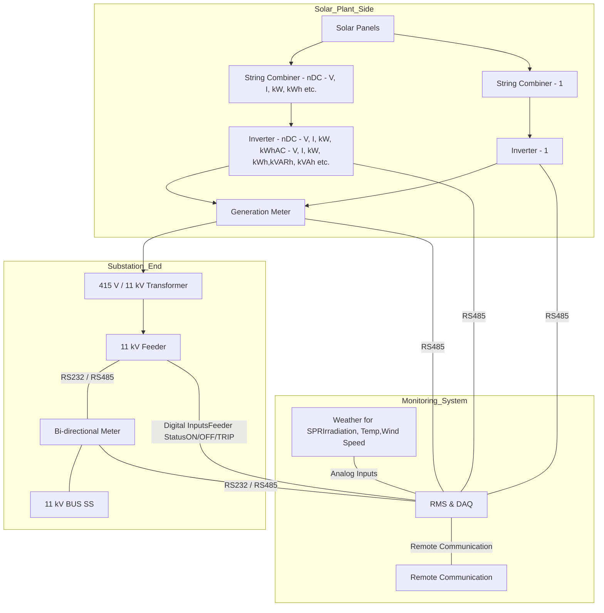

# 3. Remote Monitoring System (RMS)

3.1. As per the MNRE guidelines for feeder level solarization under Component C of KUSUM scheme, it is mandatory for Discoms to monitor solar power generation and performance of the solar power plant through online system. The online data will be integrated with central monitoring portal of MNRE which will extract data from the State portals for monitoring of the scheme.

3.2. In line with MNRE model guidelines for State Level SEDM Software Development issued in July 2020, State Level Solar Energy Data Management (SEDM) platform has been developed to integrate & monitor the performance of all systems installed under Component A, B & C (individual as well as feeder level solarization) of PM-KUSUM scheme.

3.3. Also, as per the Specifications for Remote Monitoring System for Component A & C of the scheme, issued by MNRE on 15 Jul 2020, the SPG under this RfS shall be required to install required remote monitoring systems for solar power plant to integrate with State SEDM platform directly which in turn will have interface with National Level Solar Energy Data Management Platform of MNRE.

3.4. MNRE and Discoms will develop and host the of National and State Level SEDM platform, which is excluded from the scope of the SPG, but SPG needs to operate and do various data entries related to application processing, asset and workflow mgmt.

### Sub Station End

### Solar Plant Performance & Feeder Availability Monitoring

3.5. As shown in above diagram SPG needs to provide a remote monitoring system for:

(a) **Solar Power Plant Remote Monitoring system**: To capture electrical parameters from multiple devices such as ABT Meter, Generation Meter, Inverters, String Combiner boxes or String